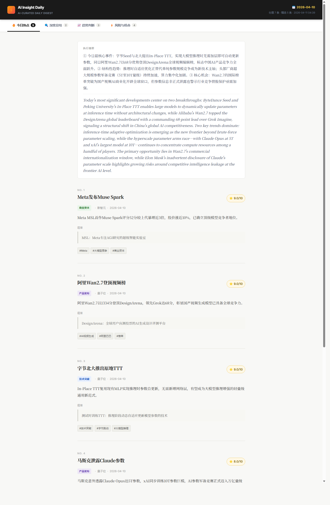

# InsightFlow-AI

InsightFlow-AI 是一个面向 AI 行业资讯的分析日报项目。系统从多来源新闻中读取数据，完成结构化抽取、多维评分、过滤聚类和日报生成，最终输出 HTML 结果文件。

## 项目内容

仓库当前保留以下核心内容：

- `src/`：核心 Pipeline 代码
- `config/`：规则与来源配置
- `prompts/`：Prompt 模板
- `data/`：输入数据、抽取缓存与输出结果
- `data/output/<date>/`：运行结果示例
- `docs/`：说明文档
- `.env.example`：本地环境变量配置示例

## 配置说明

`config/` 项目把“数据源如何看待”和“日报应该如何生成”从代码里拆了出来，改为配置驱动。

- `config/sources.yaml`：定义数据源名称、来源类别、来源权重、解析策略与标签
- `config/report_rules.yaml`：定义日报目标读者、输出语气、关注方向、筛选阈值和启用模块

这样的设计意味着，后续如果想调整读者画像、热点筛选口径或来源权重，不需要直接修改核心业务代码。

## 数据目录说明

`data/` 目录不是简单存文件，而是承担了输入层、中间缓存层和输出层三类职责：

- `data/input/raw_news.json`：原始新闻聚合结果，是 Pipeline 的入口
- `data/input/articles/`：按篇拆分的文章文本，便于人工核查
- `data/input/extractions/`：结构化抽取缓存结果，降低重复处理成本
- `data/output/<date>/`：按日期保存的日报输出结果
- `data/output/index.json`：历史输出索引

这套目录结构的价值在于，中间状态是可见、可复查、可复用的，而不是只有一份最终报告。

## 运行前准备

本项目依赖本地可用的 Claude CLI 才能运行真实的抽取、评分和洞察生成链路，因此不是开箱即跑。

运行前需要完成以下本地配置：

1. 安装并确保本机可以正常调用 Claude Code CLI
2. 复制 `.env.example` 为 `.env`
3. 在 `.env` 中填写本机实际可用的配置项：

- `ANTHROPIC_API_KEY`
- `ANTHROPIC_BASE_URL`

如果没有完成这些本地配置，项目将无法调用 Claude，也就无法跑通真实的 AI 分析流程

## 运行方式

```bash
python main.py --date 2026-04-10
```

运行完成后，结果会写入：

```text
data/output/<date>/
```

主要输出包括：

- `structured.json`
- `scored.json`
- `report.json`
- `report.md`
- `report.html`
- `pipeline_log.json`

## 在线预览

已部署至 [insightflow-ai.surge.sh](https://insightflow-ai.surge.sh)，可直接打开：

| 日期 | 链接 |
|------|------|
| 报告目录 | https://insightflow-ai.surge.sh |
| 2026-04-10 | https://insightflow-ai.surge.sh/data/output/2026-04-10/report.html |
| 2026-04-09 | https://insightflow-ai.surge.sh/data/output/2026-04-09/report.html |

## 效果展示

以下截图来自项目已生成的 HTML 日报页面，便于直接了解最终展示效果：



## 说明文档

说明文档已拆分为多份，可通过以下链接查看：

1. [数据源说明](docs/1_数据源说明.md)
2. [系统设计思路](docs/2_系统设计思路.md)
3. [AI 使用方式](docs/3_AI使用方式.md)
4. [核心流程说明](docs/4_核心流程说明.md)